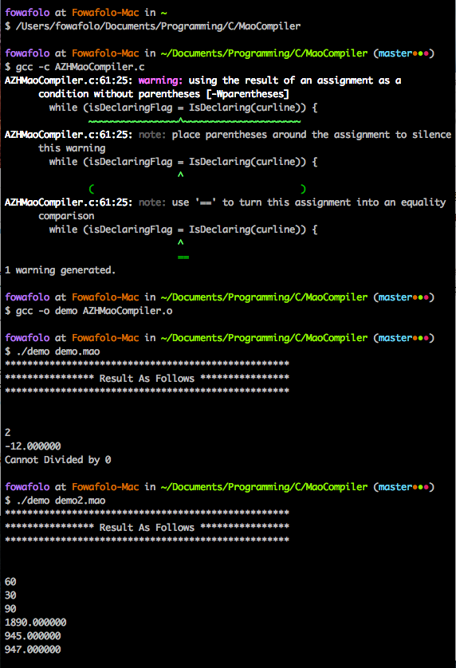

# C_MaoCompiler
### C Final Project for SSE 2015

## 这是个啥
这是我重修C语言的项目。。。这学期重修，作死啊简直。。。

## 这能干啥
这是款爷和凡少用来唬小盆友的『编译器』hhhhh~

## 咋运行
```
# cd 到某路径
$ git clone https://github.com/anzhehong/C_MaoCompiler
$ cd C_MaoCompiler
$ gcc -c AZHMaoCompiler.c
$ gcc -o demo AZHMaoCompiler.o
# 执行可执行文件运行.mao文件中的代码
$ ./demo demo.mao
$ ./demo demo2.mao
```

## 示例
